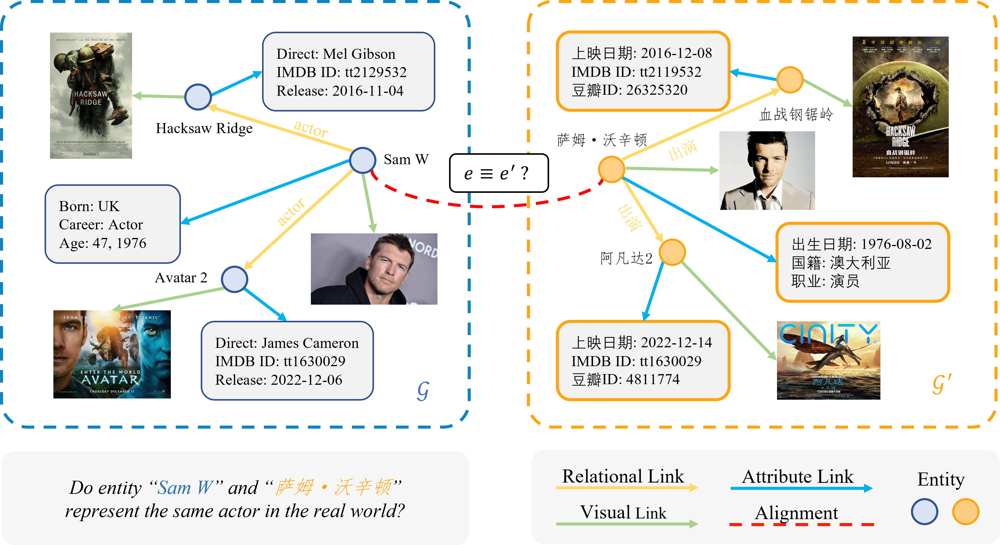

An implementation for Vanilla **PSNEA: Pseudo-Siamese Network for Entity Alignment between Multi-modal Knowledge Graphs** in ACM MM 2023. 

## Environments

We run this code on an Ubuntu 20.04.1 server equipped with an Intel(R) Xeon(R) Gold 5218 CPU @ 2.30GHz and 8 Nvidia(R) RTX 3090 GPUs. And the packages can be found in the file `requirements.txt`. 

```bash
pip install -r requirements.txt
```

## Datasets

The performance of PSNEA is validated on DBP and DWY datasets:

+ *Bilingual dataset*: DBP15k is one of the most general datasets consisting of three cross-lingual subsets `EN-FR`, `EN-ZH`, and `EN-JA`. The multi-modal version of DBP dataset come from [[&#x1F4E5;Download]](https://github.com/cambridgeltl/eva) repository. 
+ *Cross Knowledge Graphs dataset*: DWY100k is a dataset including two subsections `DBP-YG` and `DBP-WD` [[&#x1F4E5;Download]](https://github.com/nju-websoft/BootEA). 

The details of the datasets are listed as:

| Datasets      |DBP-EN-FR|         |DBP-EN-ZH|         |DBP-EN-JA|         |DWY-DBP-YG|         |DWY-DBP-WD|         |
|:-------------:|:-------:|:-------:|:-------:|:-------:|:-------:|:-------:|:--------:|:-------:|:--------:|:-------:|
|-              |  EN     |  FR     |  EN     |  ZH     |  EN     |  JA     |  DBP     |  YG     |  DBP     |  WD     |
|# Entities     |  19,993 |  19,661 |  19,572 |  19,388 |  19,780 |  19,814 |  100,000 | 100,000 |  100,000 | 100,000 |
|# Relations    |   2,209 |   1,379 |   2,317 |   2,830 |   2,096 |   2,043 |      302 |      31 |      330 |     220 |
|# Rela Triples | 115,722 | 105,998 |  95,142 |  70,414 |  93,484 |  77,214 |  428,952 | 502,563 |  463,294 | 448,774 |
|# Attr Triples | 351,094 | 273,825 | 343,218 | 248,035 | 320,616 | 248,991 |  383,757 |  98,028 |  341,770 | 779,402 |

## Bash Scripts

This repository can reproduce the results via the bash script provided in `bash_scripts/`. Considering that different datasets have different characteristics and therefore preferences for hyper-parameters configuration, we provide multiple `run.sh` files. 

Here is one example of training PSNEA on DBP dataset: 

```bash
bash bash_scripts/run_dbp.sh
```

In this way, a **minimal scale model** will be trained to test the integrity of this code.

## Contact Us

You can contact us by [[&#x2709; e-Mail]](idrfer@foxmail.com)


